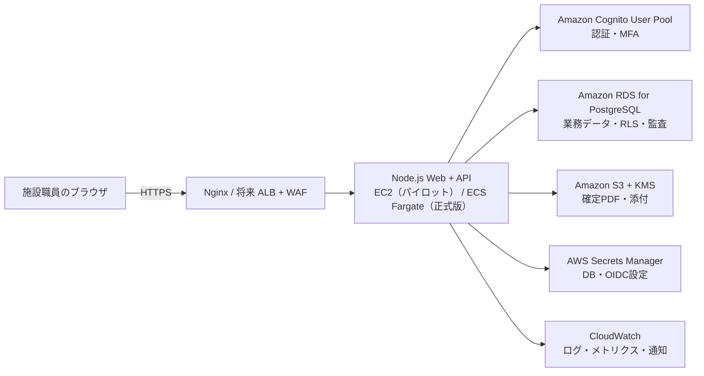

# AWS本番アーキテクチャ

最終更新: 2026-08-14

## 1. 採用方針

既存のAWS開発環境と画面資産を活かし、最初はNode.jsの単一Web/APIサービスとして実装する。データはPostgreSQLを正本とし、認証、ファイル、秘密情報、監視はAWSのマネージドサービスへ分離する。

初期からマイクロサービス化は行わない。小規模チームで保守できるモジュラーモノリスとし、法人分離、権限、監査、文書版管理をサーバーとDBで強制する。

## 2. 構成



### パイロット

- アプリ: 現在のEC2上でNode.js 20サービスをポート8015に起動し、既存Nginx/HTTPSを利用する。
- DB: 開発は既存AWS内PostgreSQLまたは専用開発RDS、本番パイロットは専用RDS PostgreSQLを使用する。
- 認証: Cognito User Poolを一つ作り、法人所属と業務ロールはアプリDBで管理する。
- ファイル: S3の非公開バケットへ法人プレフィックス付きで保存する。アプリ経由の短期署名URLのみ発行する。

### 正式提供

- アプリをECS Fargateの2タスク以上へ移し、ALB、WAF、Auto Scalingを利用する。
- RDSをMulti-AZにし、自動バックアップとPoint-in-Time Recoveryを有効化する。
- S3 Versioning、SSE-KMS、ライフサイクル、別障害境界へのバックアップを設定する。
- CloudWatchアラームと通知先、AWS Backupの復元訓練手順を運用する。

## 3. 認証・セッション

- Cognitoは認証のみを担当し、法人・事業所・ロールはPostgreSQLの `memberships` を正とする。
- Authorization Code + PKCEを使い、認証後はランダムなサーバーセッションIDを `HttpOnly; Secure; SameSite=Lax` Cookieで保持する。
- Cognitoトークンはブラウザの `localStorage` へ保存しない。サーバー側セッションはトークンハッシュ、利用者、期限、最終利用、失効日時を保持する。
- ログイン完了時と各API呼出し時に所属の有効性を確認し、退職・所属解除・権限変更で既存セッションを失効できるようにする。
- 状態変更APIはCSRFトークン、Origin検証、レート制限を適用する。
- 法人管理者と運営管理者はCognito MFA必須とする。

## 4. テナント分離

- テナントIDはURLやリクエスト本文ではなく、認証セッションから決定する。
- APIはリクエストごとにDBトランザクションを開始し、`SET LOCAL app.tenant_id`、`app.user_id`、`app.facility_ids` を設定する。
- 全業務テーブルは `tenant_id` を持ち、PostgreSQL Row Level Securityを `ENABLE` と `FORCE` の両方で有効化する。
- 外部キーは可能な限り `(tenant_id, resource_id)` の複合参照にし、テナントを跨ぐ関連付けをDB制約で拒否する。
- RLSで使用する列と主要な `tenant_id + facility_id + date/status` 条件には複合インデックスを付ける。
- API用DBロールにはスキーマ変更、RLS回避、不要なDELETE権限を与えない。
- PDF、S3キー、キャッシュ、ジョブ、監査イベントにもテナントIDを含める。

## 5. データ更新と競合

- 更新可能な行は `row_version bigint` を持ち、更新時に `WHERE id = ? AND row_version = ?` を条件にする。
- 更新件数が0ならHTTP 409とし、現在版、更新者、更新時刻を返す。本文全体はエラー応答へ含めない。
- 作成APIは `Idempotency-Key` とレスポンスハッシュを保存し、同一キーの再送を同じ結果として返す。
- 文書状態遷移、承認、同意、交付、確定PDF登録は単一DBトランザクションで処理する。
- 下書きはセクション単位で保存する。承認済み・交付済み版はアプリとDBトリガーの両方で更新を拒否する。

## 6. API境界

```text
/api/v1/session
/api/v1/facilities
/api/v1/memberships
/api/v1/children
/api/v1/children/:childId/guardians
/api/v1/children/:childId/daily-logs
/api/v1/children/:childId/contact-book
/api/v1/children/:childId/assessments
/api/v1/children/:childId/consultation-plans
/api/v1/children/:childId/individual-support-plans
/api/v1/children/:childId/monitoring-sessions
/api/v1/documents/:documentId/transitions
/api/v1/documents/:documentId/pdf
/api/v1/audit-events
```

- `tenant_id` はAPI入力として受け取らない。
- 施設・利用児のスコープ外は、情報推測を避けるため403ではなく404を返す。
- 入力はスキーマ検証し、未知のフィールドを拒否する。
- 一覧はカーソルページングを使用し、任意件数の全件取得を許可しない。
- エラーは `code`、利用者向け説明、`requestId` のみを返す。

## 7. PDF・添付

- 画面印刷を正式帳票の正本にせず、サーバー側でテンプレート版からPDFを生成する。
- S3キーは `tenants/{tenantId}/documents/{documentId}/{snapshotId}.pdf` とし、DBにキー、S3 VersionId、SHA-256、サイズ、MIME、テンプレート版を保持する。
- バケットはBlock Public Access、SSE-KMS、Versioning、Object Lock COMPLIANCEを使用する。保持年数は本番作成前に施設・自治体の規程と照合する。
- 閲覧・ダウンロード前にAPIで所属・文書権限を検証し、DBに固定したVersionIdをS3から取得して完全性を再検証したうえでAPIからストリームする。S3キーや署名URLはブラウザへ返さない。
- PDFは短いDB予約、DB接続外のChromium/KMS/S3処理、短いDB確定のjob/lease方式で生成する。添付アップロードを将来追加する場合は、MIME、拡張子、サイズを検証し、マルウェア検査完了前は利用不可にする。
- 交付済みPDFは上書きせず、訂正版を別スナップショットとして追加する。

## 8. ログ・監視

- アプリ運用ログは失敗・拒否をJSON構造化し、リクエストID、公開用エラーコード、状態コードだけを記録する。成功時の応答時間・件数はALB/ECS/CloudWatchメトリクスで監視し、actor/tenant/閲覧経路はRDSの追記専用業務監査へ分離する。
- 氏名、住所、証書番号、日誌本文、連絡帳本文、認証トークン、Cookieをログへ出さない。
- 5xx率、p95応答時間、DB接続数、ストレージ残量、バックアップ失敗、Cognito異常、証明書期限を監視する。
- 業務監査ログと運用ログを分離する。業務監査ログはアプリ画面から検索でき、削除権限を通常ロールへ与えない。

## 9. バックアップ・復旧

- RDS自動バックアップとPITRを有効化し、パイロットのRPOを15分、RTOを4時間以内とする。
- 日次スナップショット、S3 Versioning、設定とマイグレーションのリポジトリ管理を行う。
- 四半期ごとに別DBへ復元し、テナント件数、利用児件数、文書ハッシュ、添付整合性を検証する。
- DBマイグレーションは後方互換の「追加→移行→切替→削除」で行い、同一リリースで破壊的変更をしない。

## 10. 環境分離

| 環境 | データ | 用途 |
| --- | --- | --- |
| local | 架空データのみ | 開発・単体テスト |
| staging | 架空・匿名化データのみ | 結合、帳票、受入試験 |
| production | 実データ | 正式業務 |

- AWSアカウントまたは少なくともVPC、DB、Cognito、S3、KMSキー、Secretsを環境別に分離する。
- 本番DBのコピーを開発へ持ち込まない。
- デモ画面と本番画面をビルド設定だけで切り替えず、データ・認証・URLを明確に分離する。

## 11. 採用理由とトレードオフ

- **EC2から開始**: 現在の公開環境とポート8015を利用でき、移行リスクが小さい。正式提供前にECSへ移すことで可用性と再現性を高める。
- **RDS PostgreSQL**: 文書、版、目標、権限、監査の整合性とトランザクション、RLSが必要なため。DynamoDBより業務関係を自然に表現できる。
- **Cognito**: パスワード、MFA、回復フローを自前実装しないため。テナント所属はDBで管理し、認証と認可を混同しない。
- **単一User Pool**: 初期顧客数での運用を簡潔にする。顧客ごとに独自IdP・ポリシーが必要になった場合は上位プランでUser Poolまたは認可ストアを分離する。
- **モジュラーモノリス**: 現状の小規模運用で分散システムの障害点を増やさず、将来PDF生成や通知だけを分離できる境界を持つ。

## 12. AWS側で必要な準備

次のリソースはアプリコードだけでは作成できないため、AWS管理者の権限で用意する。

1. staging/production用RDS PostgreSQLとアプリ用DBロール
2. Cognito User Pool、App Client、コールバックURL、MFA設定
3. S3非公開バケット、KMSキー、アプリ用IAM権限
4. Secrets ManagerのDB接続・OIDC設定
5. CloudWatchログ、アラーム、通知先
6. production用ALB/WAF/ECSまたは同等の可用構成

現在のEC2ではNode.js 20とPostgreSQLクライアントを確認済み。ローカルPostgreSQLは稼働しているが、現行SSHユーザーにDBロール作成権限がないため、専用DB/ロールの発行が必要である。

## 13. 参考にしたAWS公式資料

- [Multi-tenant SaaS authorization and API access control](https://docs.aws.amazon.com/prescriptive-guidance/latest/saas-multitenant-api-access-authorization/introduction.html)
- [Amazon Cognito multi-tenant application best practices](https://docs.aws.amazon.com/cognito/latest/developerguide/multi-tenant-application-best-practices.html)
- [Amazon RDS automated backups](https://docs.aws.amazon.com/AmazonRDS/latest/UserGuide/USER_WorkingWithAutomatedBackups.html)
- [SaaS tenant isolation for Amazon S3](https://docs.aws.amazon.com/prescriptive-guidance/latest/patterns/implement-saas-tenant-isolation-for-amazon-s3-by-using-an-aws-lambda-token-vending-machine.html)
